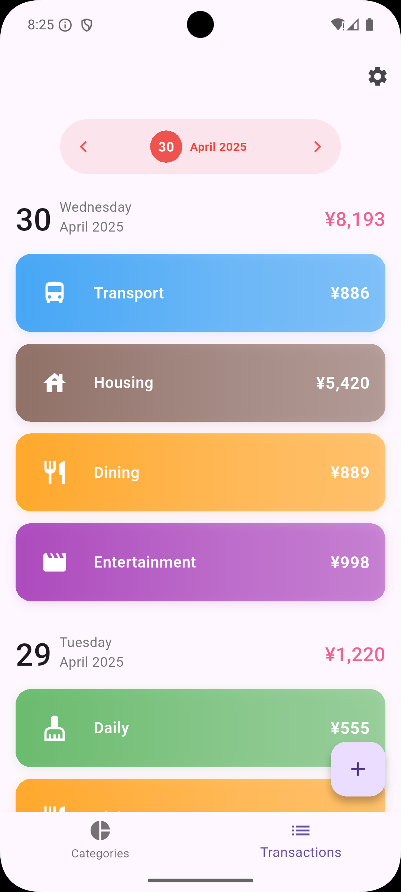
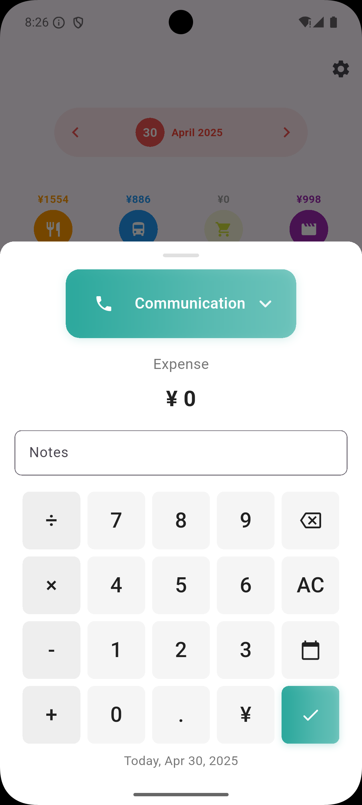
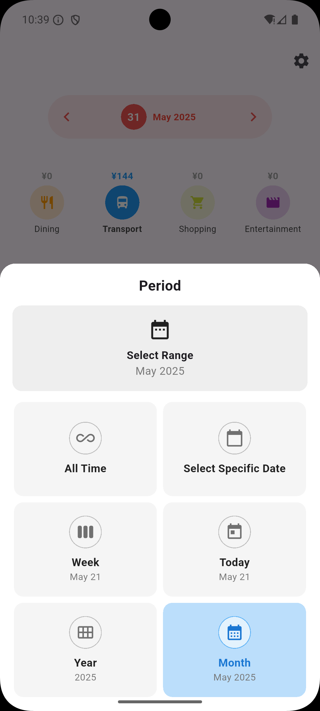

# Money Manager Flutter

A minimalist expense tracking app built with Flutter. UI inspired by 1Money.

Backend system supports cloud sync is under development.

  
  
  

  
  
  

## How to Use

### Adding Transactions

- **Quick Add**: Tap any category icon on the main screen to quickly add a transaction for that category
- **Manual Add**: Tap the "+" button in the transactions screen and select a category

### Viewing Transactions

- The TX screen shows an overview of all transactions within the selected date range
- Tap on any transaction to edit or delete it

### Date Navigation

- Tap the date button at the top to select a specific date range
- Swipe left or right to navigate to the previous or next date range

### Managing Categories

- Long press on any category icon to edit or delete the category

## Features

- Built with Flutter for cross-platform compatibility
- Local data storage using SQLite
- Clean architecture with separation of UI and business logic
- Backend system supports cloud sync (WIP)

## Future Development

- [ ] Replace the current AI-generated swipe wrapper with a smoother implementation
- [ ] Add smooth transition animations for charts and icons when adding new transactions
- [ ] Implement a more cohesive UI style throughout the app
- [ ] Add support for multiple currencies with automatic conversion
- [ ] Connect to backend synchronization service (in development)
- [ ] Add more detailed statistical analysis and reporting
- [ ] Implement budget planning features 